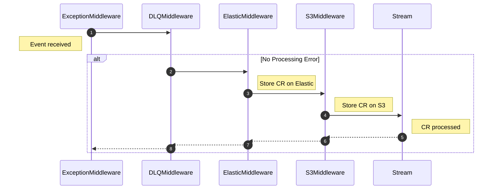

# Middleware

Kstreams allows you to include middlewares for adding behavior to streams. 

A *middleware* is a `callable` that works with every `ConsumerRecord` (CR) *before* and *after* it is processed by a specific `stream`. `Middlewares` also have access to the `stream` and `send` function.

- It takes each `CR` that arrives to a `kafka topic`.
- Then it can do something to the `CR` or run any needed code.
- Then it passes the `CR` to be processed by another `callable` (other middleware or stream).
- Once the `CR` is processed by the stream, the chain is "completed".
- If there is code after the `self.next_call(cr)` then it will be executed.

Kstreams `Middleware` have the following protocol:

::: kstreams.middleware.middleware.MiddlewareProtocol

!!! note
    The `__call__` method can return anything so previous calls can use the returned value. Make sure that the line `return await self.next_call(cr)` is in your method

!!! warning
    Middlewares only work with the new [Dependency Injection approach](https://kpn.github.io/kstreams/stream/#dependency-injection-and-typing)

## Creating a middleware

To create a middleware you have to create a class that inherits from `BaseMiddleware`. Then, the method `async def __call__` must be defined. Let's consider that we want to save the CR to `elastic` before it is processed:

```python
import typing

from kstreams import ConsumerRecord, middleware

async def save_to_elastic(cr: ConsumerRecord) -> None:
    ...


class ElasticMiddleware(middleware.BaseMiddleware):
    async def __call__(self, cr: ConsumerRecord) -> typing.Any:
        # save to elastic before calling the next
        await save_to_elastic(cr)

        # the next call could be another middleware
        return await self.next_call(cr)
```

Then, we have to include the middleware:

```python
from kstreams import ConsumerRecord, middleware

from .engine import stream_engine


middlewares = [middleware.Middleware(ElasticMiddleware)]

@stream_engine.stream("kstreams-topic", middlewares=middlewares)
    async def processor(cr: ConsumerRecord):
        ...
```

!!! note
    The `Middleware` concept also applies for `async generators` (yield from a stream)

## Adding extra configuration to middlewares

If you want to provide extra configuration to middleware you should override the __init__ method with the extra options as `keywargs` and then call `super().__init__(**kwargs)`

Let's consider that we want to send an event to a spcific `topic` when a `ValueError` is raised inside a `stream` (Dead Letter Queue)

```python
from kstreams import ConsumerRecord, types, Stream, middleware


class DLQMiddleware(middleware.BaseMiddleware):
    def __init__(self, *, topic: str, **kwargs) -> None:
        super().__init__(**kwargs)
        self.topic = topic

    async def __call__(self, cr: ConsumerRecord):
        try:
            return await self.next_call(cr)
        except ValueError:
            await self.send(self.topic, key=cr.key, value=cr.value)


# Create the middlewares
middlewares = [
    middleware.Middleware(
        DLQMiddleware, topic="kstreams-dlq-topic"
    )
]

@stream_engine.stream("kstreams-topic", middlewares=middlewares)
    async def processor(cr: ConsumerRecord):
        if cr.value == b"joker":
            raise ValueError("Joker received...")
```

## Middleware by default

Kstreams includes one middleware by default, `ExceptionMiddleware`. This middleware adds exception handlers, for particular types of expected exception cases, for example when the `Consumer` stops (kafka disconnects), user presses `CTRL+C` or any other exception that could cause the `stream` to crash.

::: kstreams.middleware.middleware.ExceptionMiddleware

## Middleware chain

It is possible to add as many middlewares as you want to split and reuse business logic, however the downside is extra complexity and the code might become slower. The middleware order is important as they are evaluated in the order that were placed in the stream.

In the following example we are adding three middelwares in the following order: `DLQMiddleware`, `ElasticMiddleware`, and `S3Middleware`. The code chain execution will be:



```python title="Multiple middlewares example"
from kstreams import ConsumerRecord, Stream, middleware


class DLQMiddleware(middleware.BaseMiddleware):
    async def __call__(self, cr: ConsumerRecord):
        try:
            return await self.next_call(cr)
        except ValueError:
            await dlq(cr.value)


class ElasticMiddleware(middleware.BaseMiddleware):
    async def __call__(self, cr: ConsumerRecord):
        await save_to_elastic(cr.value)
        return await self.next_call(cr)


class S3Middleware(middleware.BaseMiddleware):
    async def __call__(self, cr: ConsumerRecord):
        await backup_to_s3(cr.value)
        return await self.next_call(cr)


middlewares = [
    middleware.Middleware(DLQMiddleware),
    middleware.Middleware(ElasticMiddleware),
    middleware.Middleware(S3Middleware),
]


@stream_engine.stream("kstreams-topic", middlewares=middlewares)
async def processor(cr: ConsumerRecord):
    if cr.value == event_2:
        raise ValueError("Error from stream...")
    await save_to_db(cr.value)
```

!!! note
    In the example we can see that always the `cr` will be save into `elastic` and `s3` regardless an error

## Executing Code after the CR was processed

As mentioned in the introduction, it is possible to execute code after the `CR` is handled. To do this, we need to place code after `next_call` is called:

```python title="Execute code after CR is handled"
from kstreams import ConsumerRecord, Stream, middleware


class DLQMiddleware(middleware.BaseMiddleware):
    async def __call__(self, cr: ConsumerRecord):
        try:
            return await self.next_call(cr)
        except ValueError:
            await dlq(cr.value)


class ElasticMiddleware(middleware.BaseMiddleware):
    async def __call__(self, cr: ConsumerRecord):
        return await self.next_call(cr)
        # This will be called after the whole chain has finished
        await save_to_elastic(cr.value)


middlewares = [
    middleware.Middleware(DLQMiddleware),
    middleware.Middleware(ElasticMiddleware),
]


@stream_engine.stream("kstreams-topic", middlewares=middlewares)
async def processor(cr: ConsumerRecord):
    if cr.value == event_2:
        raise ValueError("Error from stream...")
    await save_to_db(cr.value)
```

!!! note
    In the example we can see that only if there is not an `error` the event is saved to `elastic`

## Deserialization

To `deserialize` bytes into a different structure like `dict` middlewares are the preferred way to it. Examples:

::: examples.dataclasses-avroschema-example.dataclasses_avroschema_example.middlewares.AvroDeserializerMiddleware
    options:
        show_bases: false
        members:
         -  

::: examples.confluent-example.confluent_example.middlewares.ConfluentMiddlewareDeserializer
    options:
        show_bases: false
        members:
         -  